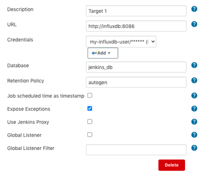
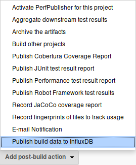
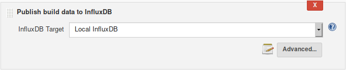
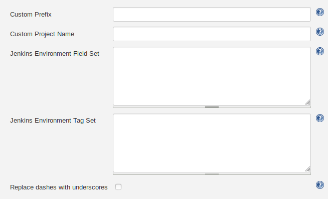

# InfluxDB Plugin for Jenkins

[](https://plugins.jenkins.io/influxdb)
[](https://ci.jenkins.io/job/Plugins/job/influxdb-plugin/job/master/)
[](https://plugins.jenkins.io/influxdb)

## Description

Collects data from various other Jenkins plugins and sends metrics to InfluxDB. It's also
possible to send custom data inside pipeline jobs.

## Breaking Changes

Support for InfluxDB 1.7 and lower was dropped in plugin release 3.0.

You can find all breaking changes for each version in the [breaking changes documentation](doc/breaking_changes.md).

## Configuration

### Configuration as Code

To configure InfluxDB plugin in Jenkins add the following to `jenkins.yaml`:

```yaml
unclassified:
  influxDbGlobalConfig:
    targets:
    - credentialsId: "some_id"
      database: "some_database"
      description: "some description"
      exposeExceptions: true
      globalListener: true
      globalListenerFilter: "some filter"
      jobScheduledTimeAsPointsTimestamp: true
      retentionPolicy: "some_policy"
      url: "http://some/url"
      usingJenkinsProxy: true
```

> :warning: Prior 3.0, `credentialsId` needs to swapped to `username` and `password`.

### Via Jenkins UI

Create a database in InfluxDB and a user with access rights. In Jenkins,
go to *Manage Jenkins \> Configure System \> InfluxDB Targets* and click
"Add". Provide the database information. The "URL" parameter requires
the whole URL of the InfluxDB database, including the `http(s)://` and the
database port. Also, provide the retention policy you want the data to
be stored in InfluxDB (e.g. `15m` or `2d`). By default, it is `infinite`.
Exceptions generated by the InfluxDB plugin can also be
ignored by deselecting the "Expose Exceptions" checkbox.

> :warning: When you are using InfluxDB 1.x targets, **leave the Organization blank**. InfluxDB 2.x
> uses organizations and buckets instead of databases and retention policies, so `organization` field is
> used as an identifier whether the target is InfluxDB 1.x or 2.x.



In your job, select "Publish build data to InfluxDB" from the post-build
actions.



### Via Jenkins Pipeline

From version 1.19 onwards, you can create and remove targets in pipelines directly.

```
// Get InfluxDB plugin descriptor (version < 2.0)
def influxdb = Jenkins.instance.getDescriptorByType(jenkinsci.plugins.influxdb.DescriptorImpl)

// version >= 2.0
def influxdb = Jenkins.instance.getDescriptorByType(jenkinsci.plugins.influxdb.InfluxDbStep.DescriptorImpl)

// Create target
def target = new jenkinsci.plugins.influxdb.models.Target()

// Set target details

// Mandatory fields
target.description = 'my-new-target'
target.url = 'http://influxdburl:8086'

// Not supported >= 3.0
target.username = 'my-username'

// version < 2.0
target.password = 'my-password'

// version 2.0 to 2.6
target.password = hudson.util.Secret.fromString('my-password')

// Version >= 3.0
target.credentialsId = 'my-id'

target.database = 'my-database'

// Optional fields
target.retentionPolicy = '1d'                    // default = 'autogen'
target.jobScheduledTimeAsPointsTimestamp = true  // default = false
target.exposeExceptions = true                   // default = true
target.usingJenkinsProxy = true                  // default = false

// Add a target by using the created target object
influxdb.addTarget(target)
influxdb.save()

// Write stuff to InfluxDB
influxDbPublisher(selectedTarget: 'my-new-target')

// Remove a target by using the target description field value
influxdb.removeTarget('my-new-target')
influxdb.save()
```

### Credentials

- InfluxDB 1.8 targets support only `Username with password`.
- InfluxDB 2.x supports `Username with password` for basic authentication and `Secret Text` for authentication 
token authentication.

## Usage

### Global Listener

When `globalListener` is set to `true` for a target in which no results were published during the build, it will automatically publish the result for this target when the build is completed.

To configure the global listener, you can use environment variables prefixed with `INFLUXDB_PLUGIN`. The following variables are supported and all correspond to an `influxDbPublisher` optional parameter.

- `INFLUXDB_PLUGIN_CUSTOM_PROJECT_NAME` -> `customProjectName`
- `INFLUXDB_PLUGIN_CUSTOM_PREFIX` -> `customPrefix`
- `INFLUXDB_PLUGIN_CUSTOM_FIELDS` -> `jenkinsEnvParameterField`
- `INFLUXDB_PLUGIN_CUSTOM_TAGS` -> `jenkinsEnvParameterTag`

**_NOTE:_** The environment variables must be set on the final build object. If you are creating or updating these variables in a pipeline, you should make sure they are exported with an [EnvironmentContributingAction](https://javadoc.jenkins.io/hudson/model/EnvironmentContributingAction.html).

### Freestyle Jobs

Select the InfluxDB target you wish to publish the data to.



From the "Advanced" tab you can choose to set a custom prefix for your `project_name` field,
a custom project name to be used instead of the default job name, custom fields for your
`jenkins_data` metric, and custom tags for your all your metrics.



### Pipelines

The plugin can be used by calling either the `influxDbPublisher()` or the `step()` function.

**_NOTE:_** The `influxDbPublisher()` function is only supported from version 1.21 onwards.

**Pipeline syntax**

The only mandatory parameter is `selectedTarget`, which is the "Description" for your
target in the global configuration.

``` syntaxhighlighter-pre
influxDbPublisher(selectedTarget: 'my-target')
```

``` syntaxhighlighter-pre
step([$class: 'InfluxDbPublisher', selectedTarget: 'my-target'])
```

Optional parameters

- `customProjectName` (String) - custom project name
- `customPrefix` (String) - custom prefix for project name
- `customData` (Map) - custom fields in "jenkins_custom_data" measurement
- `customDataTags` (Map) - custom tags in "jenkins_custom_data" measurement
- `customDataMap` (Map) - custom fields in custom measurements
- `customDataMapTags` (Map<Map>) - custom tags in custom measurements (map of tags for each custom measurements)
- `jenkinsEnvParameterField` (String) - custom fields in "jenkins_data" measurement (newline-separated KEY=VALUE pairs)
- `jenkinsEnvParameterTag` (String) - custom tags in all measurements (newline-separated KEY=VALUE pairs)
- `measurementName` (String) - custom measurement name (replaces default "jenkins_data" and "jenkins_custom_data")

All `customData*` parameters contain custom data generated during the
build and not by the plugin, so they are not available in the snippet generator.


> :heavy_exclamation_mark: NOTE! Up to release 1.10.3, pipeline was configured with using the url and database.
>
>``` syntaxhighlighter-pre
>step([$class: 'InfluxDbPublisher',
>        target: 'http://127.0.0.1:8086,jenkins_db',
>        ...
>    ])
>```
> This form of configuration is not supported from version 1.11 onwards.

Pipelines don't have post-build actions, so the build result, build
ordinal, and the build success boolean will default to `"?"`, `5`,
and `false` respectively, unless set manually before calling `InfluxDbPublisher`.
Only the build result needs to be set manually, as the boolean value and ordinal are set
based on build result. Also, the build status will appear as `"?"` and the build
duration might be a little off, because the build is not actually finished.
If you want to get those pieces of information you need to configure the plugin
separately on each job as a post-build action. The jobs can be run with,
for example, the [Build Pipeline Plugin](https://wiki.jenkins-ci.org/display/JENKINS/Build+Pipeline+Plugin)
to get data from all jobs to InfluxDB. Alternatively, you can insert the
information in your build manually inside your Groovy script.

``` syntaxhighlighter-pre
try {
    // Build things here
    if (currentBuild.result == null) {
        currentBuild.result = 'SUCCESS' // sets the ordinal as 0 and boolean to true
    }
} catch (err) {
    if (currentBuild.result == null) {
        currentBuild.result = 'FAILURE' // sets the ordinal as 4 and boolean to false
    }
    throw err
} finally {
    influxDbPublisher(selectedTarget: 'my-target')
}
```

## Custom Data

You can write custom data to InfluxDB like this:

```
def myFields = [:]
myFields['field_a'] = 11
myFields['field_b'] = 12
influxDbPublisher(selectedTarget: 'my-target', customData: myFields)
```

This adds the fields `field_a` and `field_b` with values `11` and `12` respectively to a measurement called `jenkins_custom_data`.

You can also add tags to this measurement with the `customDataTags` parameter.

Alternatively, you can write custom data to InfluxDB with a higher degree of customization like this:

```
def myFields1 = [:]
def myFields2 = [:]
def myCustomMeasurementFields = [:]
myFields1['field_a'] = 11
myFields1['field_b'] = 12
myFields2['field_c'] = 21
myFields2['field_d'] = 22
myCustomMeasurementFields['series_1'] = myFields1
myCustomMeasurementFields['series_2'] = myFields2
myTags = ['series_1':['tag_a':'a','tag_b':'b'],'series_2':['tag_c':'c','tag_d':'d']]
influxDbPublisher(selectedTarget: 'my-target', customDataMap: myCustomMeasurementFields, customDataMapTags: myTags)
```

This creates 2 measurements, `series_1` and `series_2`.
It adds the fields `field_a` and `field_b` with values `11` and `12` respectively to measurement `series_1`.
It adds the fields `field_c` and `field_d` with values `21` and `22` respectively to measurement `series_2`.

You can also add tags to your custom measurements with the `customDataMapTags` parameter.
You **must** use the same map keys as measurement names as in `customDataMap`.


## Supported Metrics

See all available metrics from the [available metrics documentation](doc/available_metrics.md).

## Contribution

Create a pull request to the `development` branch.
**No pull requests are merged directly to `master`**.
Comment your changes sufficiently and create appropriate tests.

For feature requests and bug reports,
please use the [Jenkins issue tracker](https://issues.jenkins-ci.org/issues/?jql=project%20%3D%20JENKINS%20AND%20component%20%3D%20influxdb-plugin).

## Acknowledgements

This plugin was inspired by [Jouni Rajala](https://github.com/jrajala-eficode/jenkins-ci.influxdb-plugin)
and [Christoph Burmeister](http://christoph-burmeister.eu/?p=2906).
