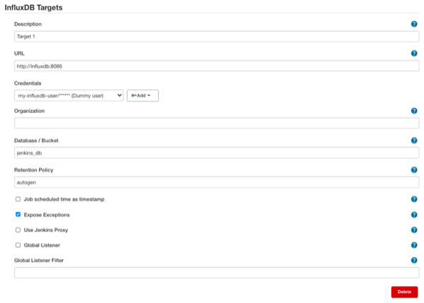

# InfluxDB Plugin for Jenkins

[](https://plugins.jenkins.io/influxdb)
[](https://ci.jenkins.io/job/Plugins/job/influxdb-plugin/job/master/)
[](https://plugins.jenkins.io/influxdb)

## Description

Collects data from various other Jenkins plugins and sends metrics to InfluxDB. It's also
possible to send custom data inside pipeline jobs.

> :warning: From version 1.13 onwards different plugins are listed as optional
dependencies. In order to get rid of mandatory dependency errors,
the InfluxDB plugin must be re-installed.

> :warning: Breaking changes in 2.0
> - From version 2.0 onwards `selectedTarget` is a **mandatory** parameter
for pipelines and the `target` parameter is no longer supported.
> - Configuration As Code: the configuration needs to be changed from
`influxDbPublisher` to `influxDbGlobalConfig`.
> - Might cause issues when creating new targets in pipelines. The
`InfluxDbPublisher` instance is now
under jenkinsci.plugins.influxdb.**InfluxDbStep**.DescriptorImpl.


## Supported Metrics

- All metrics
    - Build number
    - Project Name
    - Project Path
- `jenkins_data`
    - Build health
    - Build status message
    - Build time
    - Build Agent name
    - Job duration
    - Build result
    - Build result ordinal (0=Stable, 1=Unstable, 2=Failure, 3=Not built, 4=Aborted, 5=Unknown (for pipelines))
    - Successful build boolean
    - Last stable build number (or 0 if never)
    - Last successful build number (or 0 if never)
    - Tests failed (unit test results from JUnit Plugin)
    - Tests skipped (unit test results from JUnit Plugin)
    - Tests total (unit test results from JUnit Plugin)
    - Time in queue (from Metrics plugin)
    - Build scheduled time
    - Build start time
    - Build measured time
- `cobertura_data`
    - Package coverage %
    - Class coverage %
    - Line coverage %
    - Branch coverage %
    - Amount of packages
    - Amount of source files
    - Amount of classes
- `rf_results`
    - Test case name
    - Suite name
    - Duration
    - Amount of suites
    - Amount of passed tests
    - Amount of failed tests
    - Amount of total tests
    - Pass percentage of all tests
    - Amount of passed critical tests
    - Amount of failed critical tests
    - Total amount of critical tests
    - Pass percentage of critical tests
- `suite_result`
    - All the same data as for `rf_results`, except:
        - Pass percentage for all tests
        - Pass percentage of critical tests
        - Test case name
- `tag_point`
    - All the same data as for `rf_results`, except:
        - Pass percentage of all tests
        - Pass percentage of critical tests
        - Test case name
        - Suite name
        - Amount of suites
    - Extra data for this measurement:
        - Tag name
- `testcase_point`
    - All the same data as for `rf_results`, except:
        - Amount of suites
        - Amount of total tests
        - Pass percentage of critical tests
        - Total amount of critical tests
        - Pass percentage of all tests
- `jacoco_data`
    - Package coverage %
    - Class coverage %
    - Line coverage %
    - Branch coverage %
    - Method coverage %
    - Instruction coverage %
- `performance_data`
    - Total amount of errors
    - Percentage of errors
    - Average sample duration
    - Max/min sample duration
    - Size of samples
    - Total count of samples
    - 90 percentile
- `sonarqube_data`
    - Amount of major/minor/critical/blocker/info issues
    - Lines of code
    - Build display name
- `changelog_data`
    - Affected files
    - Commit authors
    - Commit messages
    - Commit count
- `perfpublisher_summary`
    - Number of total/executed/not-executed/passed/failed/success/true-false tests
    - Best compile time test value/name
    - Worst compile time test value/name
    - Average compile time
    - Best performance test value/name
    - Worst performance test value/name
    - Average performance
    - Best execution time test value/name
    - Worst execution time test value/name
- `perfpublisher_metric`
    - Metric name
    - Average value for metric
    - worst value for metric
    - best value for metric
- `perfpublisher_test`
    - Test name
    - Was test successful/executed
    - Test message
    - Compile time
    - Execution time
    - Performance
- `perfpublisher_test_mnetric`
    - Test name
    - Metric name/value/relevancy


## Configuration

### Via Jenkins UI

Create a database in InfluxDB and a user with access rights. In Jenkins,
go to *Manage Jenkins \> Configure System \> InfluxDB Targets* and click
"Add". Provide the database information. The "URL" parameter requires
the whole URL of the InfluxDB database, including the `http(s)://` and the
database port. Also, provide the retention policy you want the data to
be stored in InfluxDB (e.g. `15m` or `2d`). By default, it is `infinite`.
Exceptions generated by the InfluxDB plugin can also be
ignored by deselecting the "Expose Exceptions" checkbox.



In your job, select "Publish build data to InfluxDB" from the post-build
actions.


### Via Jenkins Pipeline

From version 1.19 onwards, you can create and remove targets in pipelines directly.

```
// Get InfluxDB plugin descriptor (version < 2.0)
def influxdb = Jenkins.instance.getDescriptorByType(jenkinsci.plugins.influxdb.DescriptorImpl)

// version >= 2.0
def influxdb = Jenkins.instance.getDescriptorByType(jenkinsci.plugins.influxdb.InfluxDbStep.DescriptorImpl)

// Create target
def target = new jenkinsci.plugins.influxdb.models.Target()

// Set target details

// Mandatory fields
target.description = 'my-new-target'
target.url = 'http://influxdburl:8086'
target.username = 'my-username'

// version < 2.0
target.password = 'my-password'

// version >= 2.0
target.password = hudson.util.Secret.fromString('my-password')

target.database = 'my-database'

// Optional fields
target.retentionPolicy = '1d'                    // default = 'autogen'
target.jobScheduledTimeAsPointsTimestamp = true  // default = false
target.exposeExceptions = true                   // default = true
target.usingJenkinsProxy = true                  // default = false

// Add a target by using the created target object
influxdb.addTarget(target)
influxdb.save()

// Write stuff to InfluxDB
influxDbPublisher(selectedTarget: 'my-new-target')

// Remove a target by using the target description field value
influxdb.removeTarget('my-new-target')
influxdb.save()
```

## Usage

### Freestyle Jobs

Select the InfluxDB target you wish to publish the data to.


From the "Advanced" tab you can choose to set a custom prefix for your `project_name` field,
a custom project name to be used instead of the default job name and custom fields and tags
for your `jenkins_data` metric.


### Pipelines

The plugin can be used by calling either the `influxDbPublisher()` or the `step()` function.

The `influxDbPublisher()` function is only supported from version 1.21 onwards.

**Pipeline syntax**

The only mandatory parameter is `selectedTarget`, which is the "Description" for your
target in the global configuration.

``` syntaxhighlighter-pre
influxDbPublisher(selectedTarget: 'my-target')
```

``` syntaxhighlighter-pre
step([$class: 'InfluxDbPublisher', selectedTarget: 'my-target'])
```

Optional parameters

- `customProjectName` (String) - custom project name
- `customPrefix` (String) - custom prefix for project name
- `customData` (Map) - custom fields in "jenkins_custom_data" measurement
- `customDataTags` (Map) - custom tags in "jenkins_custom_data" measurement
- `customDataMap` (Map) - custom fields in custom measurements
- `customDataMapTags` (Map) - custom tags in custom measurements
- `jenkinsEnvParameterField` (String) - custom fields in "jenkins_data" measurement (newline-separated KEY=VALUE pairs)
- `jenkinsEnvParameterTag` (String) - custom tags in "jenkins_data" measurement (newline-separated KEY=VALUE pairs)
- `measurementName` (String) - custom measurement name (replaces default "jenkins_data" and "jenkins_custom_data")

All `customData*` parameters contain custom data generated during the
build and not by the plugin, so they are not available in the snippet generator.


> :heavy_exclamation_mark: NOTE! Up to release 1.10.3, pipeline was configured with using the url and database.
>
>``` syntaxhighlighter-pre
>step([$class: 'InfluxDbPublisher',
>        target: 'http://127.0.0.1:8086,jenkins_db',
>        ...
>    ])
>```
> This form of configuration is not supported from version 1.11 onwards.

Pipelines don't have post-build actions, so the build result, build
ordinal, and the build success boolean will default to `"?"`, `5`,
and `false` respectively, unless set manually before calling `InfluxDbPublisher`.
Only the build result needs to be set manually, as the boolean value and ordinal are set
based on build result. Also, the build status will appear as `"?"` and the build
duration might be a little off, because the build is not actually finished.
If you want to get those pieces of information you need to configure the plugin
separately on each job as a post-build action. The jobs can be run with,
for example, the [Build Pipeline Plugin](https://wiki.jenkins-ci.org/display/JENKINS/Build+Pipeline+Plugin)
to get data from all jobs to InfluxDB. Alternatively, you can insert the
information in your build manually inside your Groovy script.

``` syntaxhighlighter-pre
try {
    // Build things here
    if (currentBuild.result == null) {
        currentBuild.result = 'SUCCESS' // sets the ordinal as 0 and boolean to true
    }
} catch (err) {
    if (currentBuild.result == null) {
        currentBuild.result = 'FAILURE' // sets the ordinal as 4 and boolean to false
    }
    throw err
} finally {
    influxDbPublisher(selectedTarget: 'my-target')
}
```

## Custom Data

You can write custom data to InfluxDB like this:

```
def myFields = [:]
myFields['field_a'] = 11
myFields['field_b'] = 12
influxDbPublisher(selectedTarget: 'my-target', customData: myFields)
```

This adds the fields `field_a` and `field_b` with values `11` and `12` respectively to a measurement called `jenkins_custom_data`.

You can also add tags to this measurement with the `customDataTags` parameter.

Alternatively, you can write custom data to InfluxDB with a higher degree of customization like this:

```
def myFields1 = [:]
def myFields2 = [:]
def myCustomMeasurementFields = [:]
myFields1['field_a'] = 11
myFields1['field_b'] = 12
myFields2['field_c'] = 21
myFields2['field_d'] = 22
myCustomMeasurementFields['series_1'] = myFields1
myCustomMeasurementFields['series_2'] = myFields2
influxDbPublisher(selectedTarget: 'my-target', customDataMap: myCustomMeasurementFields)
```

This creates 2 measurements, `series_1` and `series_2`.
It adds the fields `field_a` and `field_b` with values `11` and `12` respectively to measurement `series_1`.
It adds the fields `field_c` and `field_d` with values `21` and `22` respectively to measurement `series_2`.

You can also add tags to your custom measurements with the `customDataMapTags` parameter.
You **must** use the same map keys as measurement names as in `customDataMap`.


## Contribution

Create a pull request to the `development` branch.
**No pull requests are merged directly to `master`**.
Comment your changes sufficiently and create appropriate tests.

If you have an idea for a new feature or you want to report a bug,
please use the [Jenkins issue tracker](https://issues.jenkins-ci.org/issues/?jql=project%20%3D%20JENKINS%20AND%20component%20%3D%20influxdb-plugin).
